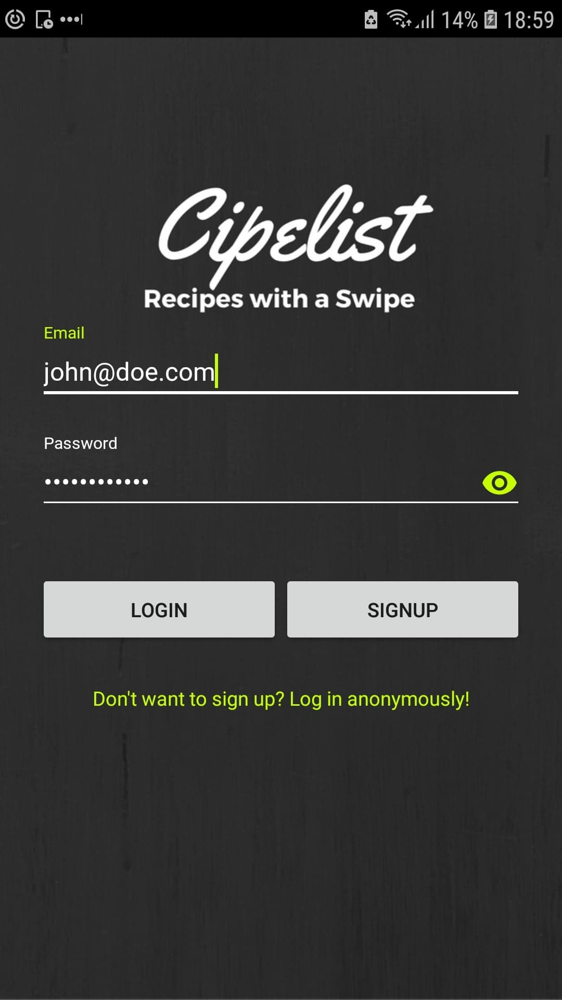

# Cipelist

An android application that helps you generate a great grocery list on the fly for awesome recipes. Currently uses the yummly API to retrieve recipes.

This was built as part of a Moblie Applications development class I took at University of Technology Sydney in 2016. So the Android code is pretty old and the API integrations will not work anymore.

Either way, it was a fun little application with a tinder-style swipe functionality that took a while to figure out for me as a newbie coder. Feel free to have a poke around or clone, this is as open source as it gets.

